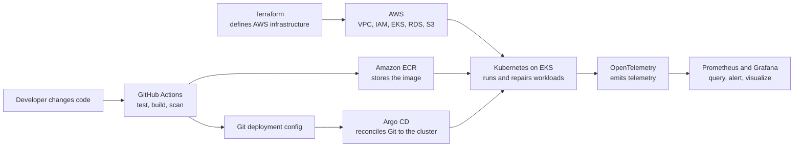

# Integrated DevOps Learning Path

This is one beginner course that connects Kubernetes, Terraform, AWS, and modern delivery/operations practices around the Instagram project. It is not four courses running side by side.

The course starts locally, where mistakes are cheap and fast to fix. AWS appears from the beginning as a mental model and a safety topic, but paid infrastructure is created only in short, deliberate milestone labs.

## First, an important progress rule

Finishing a lab does not prove understanding. The existing container and Kubernetes labs are implemented, but their learner checkpoints have not been completed. They remain unassessed until the learner can explain the problem, predict behavior, and diagnose a small failure.

The statement “I kind of understand” means **start a checkpoint gently**. It never means “mark everything understood.”

## How the pieces fit

Plain-language ownership:

- **Kubernetes** keeps the application running in the desired way.
- **Terraform** creates and changes the AWS infrastructure Kubernetes depends on.
- **AWS** supplies the real cloud network, identity, registry, cluster, database, and storage services.
- **GitHub Actions** tests, builds, scans, and publishes an immutable image.
- **Argo CD** delivers the application configuration stored in Git.
- **OpenTelemetry, Prometheus, and Grafana** help us understand what the running system is doing.

No two tools should fight over the same thing. In particular, Terraform creates the EKS platform; Argo CD eventually owns the application objects inside it.

## How one milestone is taught

Each milestone is split into 10–15 minute explanation parts. The hands-on lab is separate and may take longer.

One micro-lesson contains:

1. one concrete problem;
2. one primary idea;
3. normally no more than 3–5 new terms;
4. a simple project example;
5. prediction, small action, expected observation, and explanation;
6. 3–6 questions, each with an expandable explained answer;
7. a stop/go check.

The next concept is not added while a prerequisite is still unclear. Optional modern tools remain optional until the core problem they solve has been experienced.

## Start here

1. Open [Stage 00 — Readiness and Safety](./00-readiness-and-safety.md). Do not read all 20 stages first.
2. Use the [Learning Backlog](./learning-backlog.md) for project status.
3. Use [Learner Progress](./learner-progress.md) for demonstrated understanding.
4. Review [Cloud Safety](./cloud-safety.md) before any AWS lab.
5. Use [Toolchain](./toolchain.md) to see what is core, later, or intentionally deferred.

The complete [20-Stage Execution Plan](./20-stage-execution-plan.md) is a map to consult only when you want the larger direction.

Say `next devops` to implement the next project milestone. Say `teach D00A` to learn only the first micro-lesson interactively.

## Pace

The 20 stages are a dependency order, not a 20-week deadline. A stage can take several sessions. Move on only when:

- the idea can be explained without copying the lesson;
- one outcome can be predicted before running a command;
- one small failure can be diagnosed from evidence;
- the project evidence and cleanup are complete.

The existing [standalone Kubernetes path](../kubernetes/README.md) remains a detailed reference. This integrated path decides the order when Kubernetes, Terraform, and AWS are being learned together.
